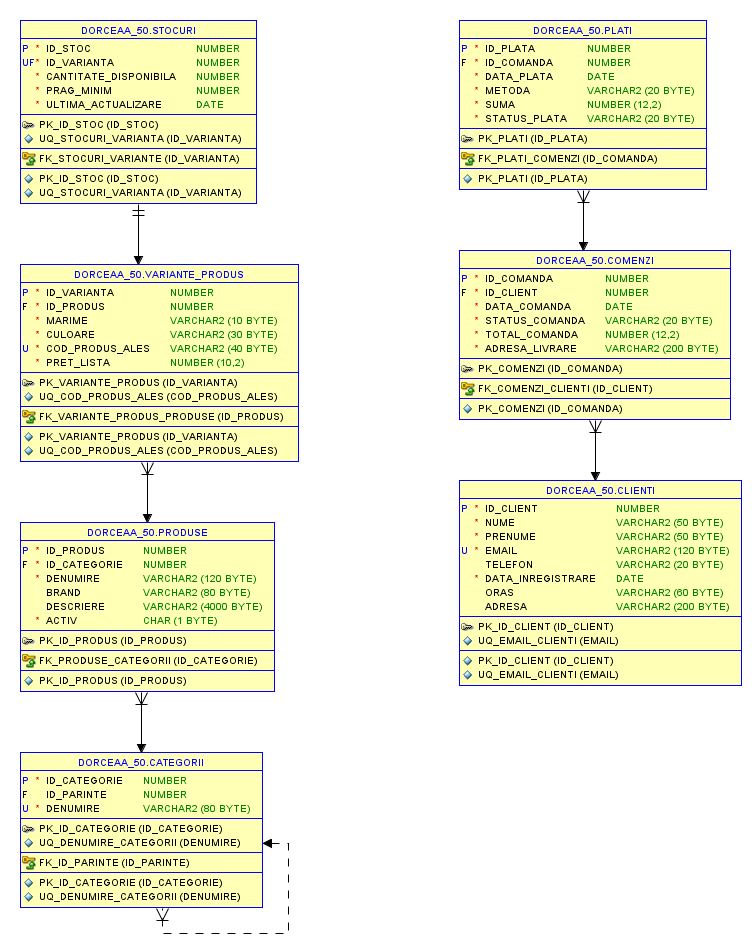

# Online-Clothing-Store-Oracle-PLSQL
A comprehensive Oracle Database and PL/SQL project designed to model, manage, and automate the core business operations of a Fashion E-Commerce store.
# Conceptual Diagram & Architecture
The database is built according to Third Normal Form (3NF) principles to eliminate redundancy and preserve data integrity. It consists of 7 interconnected entities modeling a complete fashion sales pipeline:

**CLIENTI** – Customer profiles and contact data
**CATEGORII** – Hierarchical category system (using self-referential parent-child FKs)
**PRODUSE** & **VARIANTE_PRODUS** – Master product catalog and inventory variants (size, color, SKU)
**STOCURI** – Real-time stock levels, minimal thresholds, and alert triggers
**COMENZI** & **PLATI** – Order lifecycle tracking and payment processing
            

#  Key Technical Highlights

## 1. Relational Database Design & SQL Engine
- **Hierarchical Queries:** Implemented `CONNECT BY PRIOR` / `SYS_CONNECT_BY_PATH` to query multi-level category trees.
- **Advanced SQL:** Utilized `MERGE` statements, set operators (`UNION`, `INTERSECT`, `MINUS`), analytical functions, masking techniques, and custom `VIEW`s for reporting.
- **Data Integrity:** Applied primary keys, auto-increment identities, foreign keys, unique constraints, and check constraints (e.g., email format validation, positive amounts).

## 2. Advanced PL/SQL Automation
- **Modular Architecture (Packages):**
  - `gestiune_operationala`: Encapsulates inventory updates, price adjustments per brand, and stock level validations.
  - `gestiune_vanzari_si_clienti`: Handles payment registration, order status changes, customer inactivity tracking, and voucher assignments.
- **Stored Procedures & Functions:** Custom routines returning stock statuses (`STOC BUN`, `STOC LIMITA`, `STOC INSUFICIENT`), total spending per customer, and batch price discount calculations.
- **Database Triggers:**
  - `verifica_plata`: Prevents duplicate payments or invalid payment amounts against order totals.
  - `restrictie_adresa`: Blocks customer address updates if active (unfulfilled) orders exist.
  - `adauga_stoc` & `generare_cod`: Automatically initializes inventory records and generates SKUs (`PRD-SIZE-COLOR`) upon variant insertion.
- ** Exception Handling:** Handled built-in and user-defined exceptions (`NO_DATA_FOUND`, `TOO_MANY_ROWS`, custom application errors via `RAISE_APPLICATION_ERROR`).
